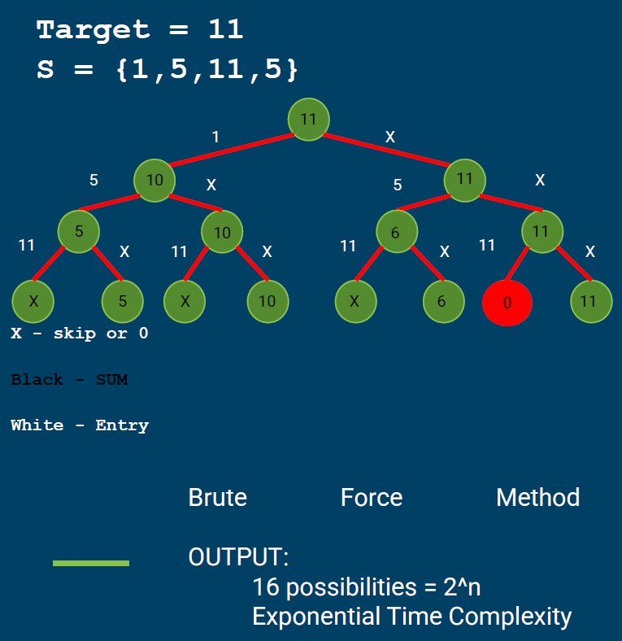
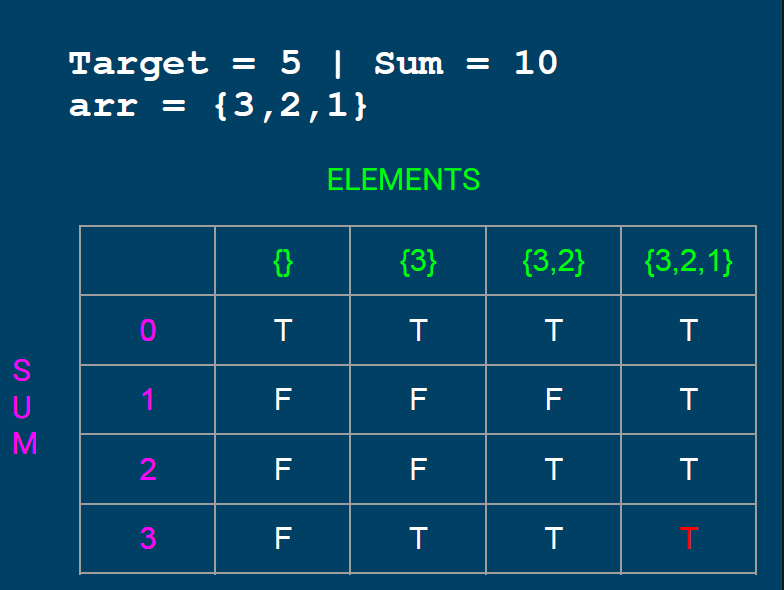

# NP-Complete Problem: Partition Problem

## **How to run demo**

- **NOTE:** The java program was created using `eclipse IDE`, might be better to use the same IDE to run.
- Download `Partition_Recursive` and `Partition_Recursive` inside `src_code` folder.
- Run the program.


## **Partition Problem**

The _Partition Problem_, or number partitioning, is the task of deciding whether a given multiset S of positive integers can be partitioned into two subsets S1 and S2 such that the sum of the numbers in S1 equals the sum of the numbers in S2.


## **Keypoints/Summary**

- The SUM of the set has to be EVEN
  - If it is ODD then the set CANNOT be divided into two subsets with equal sum
  - If there is a subset of integers that sum up to SUM/ 2 then the remaining integers in the set will also sum to
SUM/ 2
- Brute Force can be used to solve problems
with smaller values
- Dynamic Programming might be efficient with higher values (relative to brute force capacity) as long as the sum does not go near 2 ^n values (exponential sum)


## **How to solve?**
Following are the two main steps to solve this problem:

- Calculate the sum of the array. If the _sum_ is odd, there can no the two subsets with an equal sum, so return false.
- If the _sum_ of array elements is even, calculate _sum/2_ and call it the _target_. The goal now is to find a subset that has a total sum equal to _target_. We are sure that the remaining elements also sum up equal to _sum/2_ (_target_).
## **Sample Problem**

```
S[] = {3,1,1,2,2,1}
Output: true 
The array can be partitioned as A = {3, 1, 1} and B = {2, 2, 1}
Since, 

Sum of A = 3 + 1 + 1 = 5 and
Sum of B = 3 + 1 + 1 = 5

While, 
arr[] = {1, 5, 3}
Output: false 
The array cannot be partitioned into equal sum sets.
```


## **Algorithms: Recursive**

The goal is to determine each possible combination of elements in the array and calculate its corresponding sum and check whether a subset that has a sum equal to _target_ exist.

Let _isSubsetSum(arr, n, sum/2)_ be the function that returns true if 
there is a subset of arr[0..n-1] with a sum equal to sum/2

The isSubsetSum problem can be divided into two subproblems
-  isSubsetSum() without considering last element 
    (reducing n to n-1)
-  isSubsetSum considering the last element 
    (reducing sum/2 by arr[n-1] and n to n-1)

If any of the above subproblems return true, then return true. 
isSubsetSum (arr, n, sum/2) = isSubsetSum (arr, n-1, sum/2) ||
                              isSubsetSum (arr, n-1, sum/2 - arr[n-1])
### **Algorithms: Recursive (Binary Tree Representation)**


**Time Complexity**: **O(2^n)**, In the worst case, this solution tries two possibilities (whether to include or exclude) for every element.


## **Algorithms: Dynamic Programming**
The problem can be solved using dynamic programming when the sum of the elements is not too big (_sum_ not reaching 2^n values where _n_ is the number of elements in the array). We can create a 2D array part[][] of size ((sum/2) + 1)*(n+1). And we can construct the solution in a bottom-up manner such that every filled entry has the following property.

```
part[i][j] = true if a subset of {arr[0],arr[1],...arr[j-1]} has sum equal to _i_, otherwise false.
```


### **Algorithms: Dynamic Programming (2x2 array representation)**



**Time Complexity**: **O(sum*n)**, Note that if we increase the sum up to 2^n, the time complexity becomes exponential.


## **Wrap up**
#### **Recursion**
 - Utilizes Brute Force Algorithm
 - Takes a lot of calculation
 - O(2^n) time complexity
 - Inefficient
#### **Dynamic Programming**
 - Utilizes Multidimensional Array (Saves data)
Lesser calculation relative to Recursion
O(sum*n) time complexity
Exponentially large sum relative to array produces:
   -  Sum = 2^n
   - Gives O(2^n * n) time complexity, same with recursion

## **References**

- Overall code: https://www.geeksforgeeks.org/partition-problem-dp-18/?


- StableSort. (2020, March 11). Partition Problem - 2 subsets of equal sum, as closely as possible - tutorial and source code [Video]. YouTube. https://www.youtube.com/watch?v=7BynUy5ml0I&t=356s
- Tech Dose. (2020, October 16). Partition equal subset sum | Equal sum partition | Dynamic Programming | Leetcode #416 [Video]. Youtube. https://www.youtube.com/watch?v=obhWqDfzwQQ&t=102s
- Neet Code. (2021, May 20). Partition Equal Subset Sum - Dynamic Programming - Leetcode 416 - Python. [Video]. Youtube. https://www.youtube.com/watch?v=IsvocB5BJhw&t=341s
- Partition Problem using Dynamic Programming – Techie Delight. Techie Delight. (n.d). Retrieved 14 December 2021, from https://www.techiedelight.com/partition-problem/.